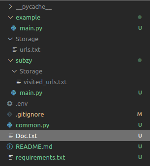

Quick and dirty reconnaissance and vulnerability scanning project. Not the most efficient, secure, and stable code. All I know is that this code led me to many bugs : ) 

### How does it work?
If it happened and I made this repo public, I apologize for not documenting it. Just read the code files, and you will understand it : ). 

It integrates the following tools.

### Integrated projects
- https://portswigger.net/burp/pro
- https://github.com/OWASP/Amass
- https://github.com/infosec-au/altdns
- https://github.com/blechschmidt/massdns
- https://github.com/hakluke/haktrails
- https://github.com/LukaSikic/subzy
- https://github.com/assetnote/commonspeak2-wordlists
- https://github.com/anshumanpattnaik/http-request-smuggling
- https://github.com/GerbenJavado/LinkFinder
- https://github.com/mvdan/xurls
- https://github.com/jaeles-project/gospider
- https://github.com/m4ll0k/SecretFinder
- https://github.com/OJ/gobuster
- https://github.com/projectdiscovery/naabu


Add your slack webhook in `.env` file, an example:
```
WEBHOOK_URL=https://hooks.slack.com/services/AAAAAAAAAAAAAAAAAAAAAAA
```


### Directory tree

